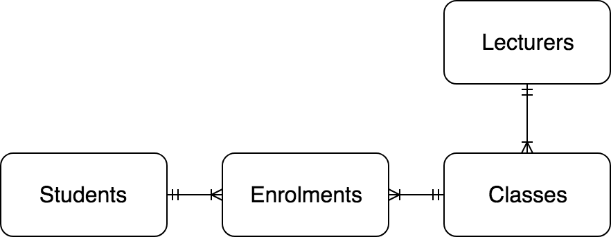

## Express TypeORM Demo

Simple demo of how to utilize TypeORM and ExpressJS in building an API

## Objective

- Build a simple API Endpoint using TypeORM + ExpressJS, with tests

### Key Results

- API Endpoint using ExpressJS
- Model the relationship using TypeORM
- Write Tests for the end points

## Simple ERD

## Endpoints (add more to make this more complete)

| Endpoint | Description |
|---|---|
| /api/v1/students | List all students |
| /api/v1/lectures | List all lecturers |

## References

- [Example using TypeORM with Express](https://github.com/typeorm/typeorm/blob/master/docs/example-with-express.md)
